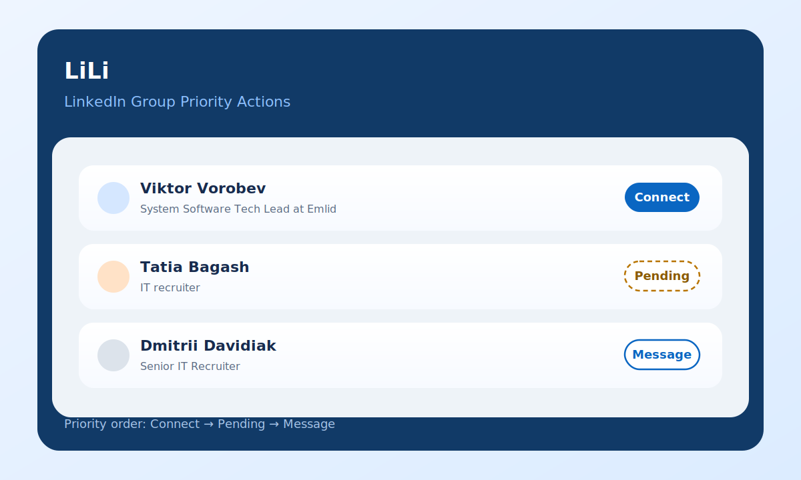

# LiLi

LiLi is a Chrome extension for LinkedIn group member pages that upgrades the action button on each member card and syncs pending state from LinkedIn sent invitations.

Instead of always showing the default `Message` button, LiLi uses a simple local rule, cached relationship state, and a best-effort profile document check when needed:

1. `1st` degree connections keep the original `Message` button.
2. Non-`1st` members show cached `Connect` or `Pending` when available, otherwise a generated loading action.
3. Clicking `Connect` stays on the current group page and runs LinkedIn's invite flow in the background.
4. LiLi attempts to skip the note dialog by triggering `Send without a note` directly.
5. If LinkedIn itself returns invitation state in live Voyager API responses, LiLi can upgrade that card from `Connect` to `Pending` without opening the profile.
6. If the group page still lacks invitation metadata, LiLi fetches the member profile document with a randomized delay, parses the embedded relationship state, and caches the result for 6 hours.
7. If you open LinkedIn's sent invitations page, LiLi stores every visible profile there as cached `Pending`.
8. If you open a concrete LinkedIn profile page, LiLi overwrites the cached status with the explicit `Connect` or `Pending` state from that page.

This makes LinkedIn group member lists more useful for outreach and triage on pages like `https://www.linkedin.com/groups/123/members/`.

## Preview

## Features

- Leaves `Message` untouched for `1st` degree connections.
- Shows a loading action for unresolved non-`1st` members while profile status is being resolved.
- Reuses cached `Connect` and `Pending` results for 6 hours.
- Sends the invite without leaving the current group members page.
- Attempts to press LinkedIn's own `Send without a note` action automatically.
- Treats LinkedIn invite responses like `CANT_RESEND_YET` as `Pending`, because LinkedIn is indicating the invitation already exists and cannot be resent yet.
- Uses the profile vanity slug already present in the group member card URL.
- Listens to live LinkedIn page Voyager responses and applies a best-effort `Pending` state when relationship data or resolved invitation metadata is already present there.
- Scans LinkedIn's embedded page JSON on first load, so `Pending` can appear immediately even when the relationship data was rendered into the initial HTML instead of arriving through a later XHR.
- Falls back to a same-origin fetch of the profile HTML document for visible non-`1st` cards when the group page does not expose enough invitation metadata.
- Prefers the explicit profile invitation state from LinkedIn's HTML over hidden withdraw templates, so a real `Connect` state is not upgraded to `Pending` by mistake.
- Overwrites cached status from the currently opened LinkedIn profile page without making an additional profile request.
- Randomizes profile status checks between `1` and `10000` ms per profile to avoid a burst of identical requests.
- Stores `Pending` in cache immediately after a successful `Connect` flow.
- Overwrites cache with `Pending` for profiles listed on `https://www.linkedin.com/mynetwork/invitation-manager/sent/`.
- Processes cards lazily near the viewport instead of scanning the whole page at once.

## How it works

LiLi runs as a content script on LinkedIn group member pages, concrete LinkedIn profile pages, and LinkedIn's sent invitations page.

On group member pages it:

1. Reads the member degree from the group card.
2. Keeps the original `Message` button for `1st` degree members.
3. Reads the profile slug from the card URL.
4. Shows cached `Connect` or `Pending` if a non-expired profile status is already known.
5. Otherwise renders a loading action and schedules a profile status request with a randomized delay.
6. Listens to LinkedIn's own `fetch` and `XHR` responses on the current page.
7. Scans LinkedIn's embedded code-block JSON on first load and also parses later network responses.
8. If LinkedIn exposes invitation metadata for the same profile slug, updates the button to `Pending` immediately.
9. If the current page still has no pending hint, fetches `/in/{slug}/`, prefers the explicit invitation state from the returned HTML, and caches the result for 6 hours.
10. On click, opens LinkedIn's invite preload flow in a hidden same-origin iframe and attempts to trigger `Send without a note` inside that hidden invite flow.
11. If the invite succeeds or LinkedIn says the invite is already pending, updates the button and cache to `Pending`.

On the sent invitations page it:

1. Scans visible profile links under the sent invitations list.
2. Extracts the LinkedIn vanity slug from each profile URL.
3. Stores each slug as cached `Pending` for 6 hours.
4. Repeats the scan when LinkedIn loads more invitations into the list.

On a concrete profile page it:

1. Reads the current profile slug from the page URL.
2. Parses the already loaded page HTML for the explicit invitation state.
3. Overwrites the cache with `Connect` or `Pending` from that page.
4. Propagates the updated cache to other open LiLi tabs through shared extension storage.

## Install locally

1. Open Chrome and go to `chrome://extensions`.
2. Enable `Developer mode`.
3. Click `Load unpacked`.
4. Select the project root folder, the one that contains [manifest.json](manifest.json).

## Permissions

- `storage`: required to persist the 6-hour profile status cache.
- `https://www.linkedin.com/*`: required to run on LinkedIn group member pages, profile pages, and the sent invitations page.

## Privacy

- LiLi does not send data to any external server.
- All logic runs in the browser on the current LinkedIn page.
- Clicking `Connect` may open LinkedIn's own invite preload flow in a hidden same-origin iframe so the current group page stays in place.
- When the group page does not expose enough relationship data, LiLi may fetch the matching LinkedIn profile document and cache the resolved status locally for 6 hours.
- When a concrete profile page is open, LiLi reuses that already loaded page to overwrite the cached relationship state and does not need an extra profile request for that overwrite.
- When the sent invitations page is open, LiLi may also cache visible sent-invitation profiles as `Pending` for the same 6-hour TTL.

## Project files

- [manifest.json](manifest.json): Chrome extension manifest.
- [content.js](content.js): degree detection, one-click invite flow, Voyager relationship parsing, and DOM replacement.
- [content.css](content.css): visual adjustments for generated Connect buttons.
- [docs/profile-status-requirement.md](docs/profile-status-requirement.md): requirement for cached profile-status resolution.
- [docs/preview.svg](docs/preview.svg): repository preview asset.
- [icons/icon-source.svg](icons/icon-source.svg): source vector used for icon design.

## Limitations

- LinkedIn changes DOM and CSS frequently, so selectors may need updates.
- The one-click invite flow assumes the profile card contains a valid public LinkedIn vanity slug and that LinkedIn keeps the current preload invite dialog structure.
- `Pending` detection is still best-effort. LiLi trusts group-page data first, then concrete profile pages and the sent invitations list, then a profile HTML fetch; any of these can break if LinkedIn changes page structure or embedded invitation markers.
- Some profiles may still require extra LinkedIn UI steps, quota checks, or email gating that cannot be bypassed reliably from this extension.
- The extension has been statically validated in this workspace, but not packaged for Chrome Web Store publication.
